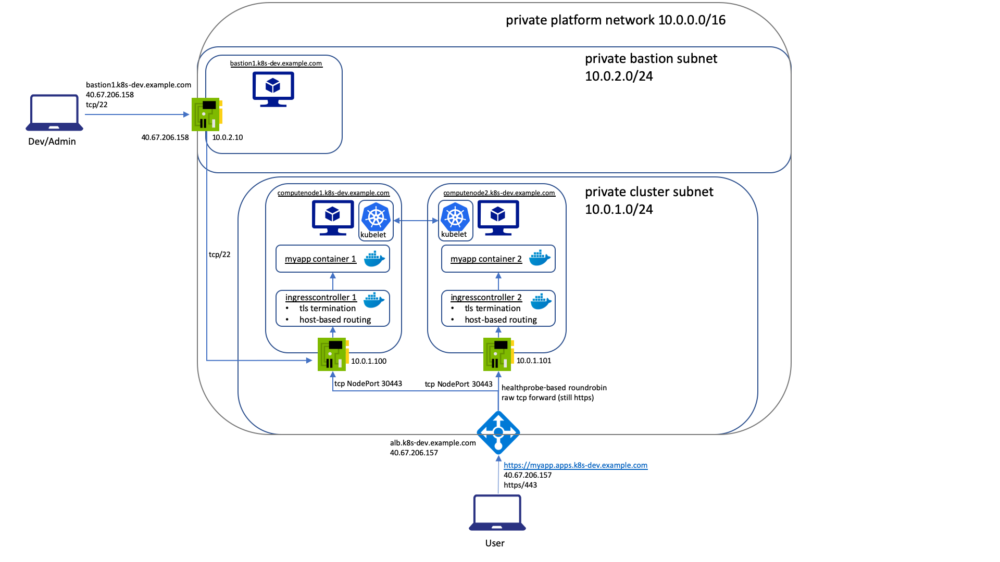

# Network Architecture

FormKube's network architecture is basically based upon the experience I gathered running Kubernetes on OpenShift
on various cloud provider's in the last couple of years (which include AWS, OpenStack, VSphere and Bare Metal).
I am explicitly not an Azure expert - feel free to propose improvements. :) 

The following illustration shows an exemplary network setup and flow provisioned by FormKube using mostly default
settings:

## IP Configuration

IPs will be statically assigned via the following patterns:

1. Masters will start with IP 10 in the cluster's subnet CIDR (i.e. master1 = 10.0.1.10, master2 = 10.0.1.11)
1. Computenodes will start with IP 100 in the cluster's subnet CIDR (i.e. computenode1 = 10.0.1.100, computenode2 = 10.0.1.101)
1. Infranodes will start with IP 200 in the cluster's subnet CIDR (i.e. computenode2 = 10.0.1.200, computenode2 = 10.0.1.201)
1. Masters will start with IP 10 in the bastion's subnet CIDR (i.e. bastion1 = 10.0.2.10, bastion2 = 10.0.2.11)

# Authors
1. [ksandermann](https://github.com/ksandermann)