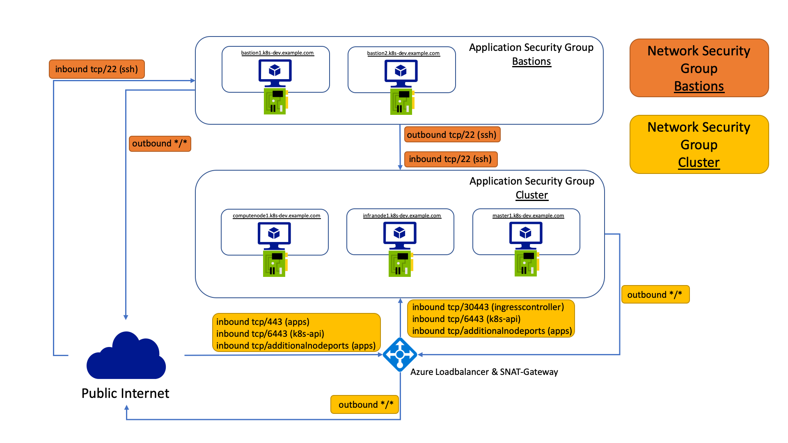

# Network Security Architecture
The following illustration gives an exemplary overview of the FormKube's network security architecture:

## Application Security Groups
FormKube is using Azure Application Security Groups to implement Sources and Destinations in Network Security Rules.
The following Application Security Groups will be bootstrapped:

**Bastions**
* Bastion(s) NIC(s)

**Cluster**
* Master(s) NIC(s)
* Computenode(s) NIC(s)
* Infranode(s) NIC(s)

## Network Security Groups
The following Network Security Groups will be bootstrapped in order to hold the implemented Network Security Rules:

**Bastions**
* Bastion(s) NIC(s)

**Cluster**
* Master(s) NIC(s)
* Computenode(s) NIC(s)
* Infranode(s) NIC(s)

## Network Security Rules

All Network Security Rules are set explicitly with priorities 150-160 to prevent issues when the default network rules from Azure change.
The ports in the following table are exemplary when bootstrapping infrastructure with default settings 

| Name                                      | Network Security Group | Direction | Source Application Security Group | Destination Application Security Group   | Source CIDR              | Destination CIDR | Source Port | Destination Port | Protocol | Priority        |
|-------------------------------------------|------------------------|-----------|-----------------------------------|------------------------------------------|--------------------------|------------------|-------------|------------------|----------|-----------------|
| PublicSshToBastionsIngress                | Bastions               | Inbound   | N/A                               | Bastions                                 | *                        | N/A              | *           | 22               | TCP      | 160             |
| BastionsSshToClusterEgress                | Bastions               | Outbound  | Bastions                          | Cluster                                  | N/A                      | N/A              | *           | 22               | TCP      | 160             |
| BastionsSshToClusterIngress               | Cluster                | Inbound   | Bastions                          | Cluster                                  | N/A                      | N/A              | *           | 22               | TCP      | 160             |
| LoadbalancersHealthProbesToClusterIngress | Cluster                | Inbound   | N/A                               | Cluster                                  | tag: AzureLoadBalanacers | N/A              | *           | *                | TCP      | 159             |
| LoadbalancersToKubernetesAPIIngress       | Cluster                | Inbound   | N/A                               | Cluster                                  | * *a*                    | N/A              | *           | 6443             | TCP      | 158             |
| LoadbalancersToIngressControllerIngress   | Cluster                | Inbound   | N/A                               | Cluster                                  | * *a*                    | N/A              | *           | 30443            | TCP      | 157             |
| LoadbalancersToClusterIngress{counter} *b*| Cluster                | Inbound   | N/A                               | Cluster                                  | * *a*                    | N/A              | *           | * *b*            | TCP      | 300+{counter}   |
| ClusterAllowAllFromLoadbalancers          | Cluster                | Inbound   | N/A                               | Cluster                                  | 168.63.129.16/32 *c*     | N/A              | *           | * *c*            | TCP      | 155             |

*a* - Traffic going through an Azure Loadbalancer is still regarded as public source from Azure NSGs.
This is not a security issue as FormKube is using private networks that are not routed publicly anyway.
For more information see [here](https://social.msdn.microsoft.com/Forums/en-US/e064ee13-10f0-4748-a729-8b2e918df9a9/azure-loadbalancer-not-working-with-vms-nsg-inbound-rule-with-azureloadbalancer-tag?forum=WAVirtualMachinesVirtualNetwork).

*b* - Additional NodePorts can be configured through variables for which additional Network Security Rules will be 
created. 
The number is not limited.

*c* - This is the fix virtual IP address of all Azure Loadbalancers.
For more information see [here](https://docs.microsoft.com/en-us/azure/load-balancer/load-balancer-troubleshoot).

# Authors
1. [ksandermann](https://github.com/ksandermann)